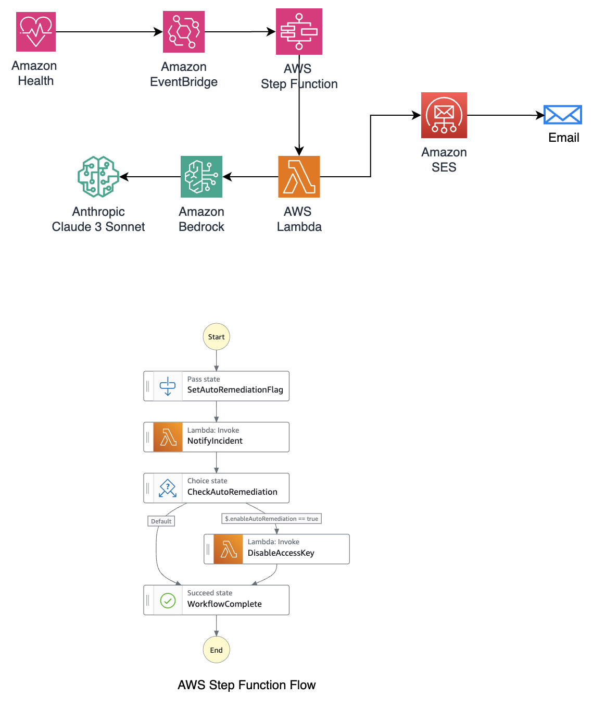

# AWS Access Key Exposure Detection and Remediation System

## Overview
This solution provides automated detection and response to exposed AWS access key incidents. It uses AWS Health events to trigger a workflow that analyzes the exposure, sends detailed notifications, and optionally disables compromised access keys automatically.

## Architecture


### Components
1. **AWS EventBridge Rule**
   - Monitors AWS Health events for exposed credentials
   - Triggers Step Functions workflow

2. **Step Functions Workflow**
   - Orchestrates the incident response process
   - Controls conditional auto-remediation
   - Manages notification and remediation flow

3. **Notification Lambda**
   - Analyzes CloudTrail for access key usage for last 1 day
   - Generates AI-powered incident summary using Claude 3 Sonnet
   - Sends detailed HTML email notifications

4. **Remediation Lambda**
   - Automatically disables compromised access keys
   - Automatically add a Deny All policy on IAM user
   - Sends confirmation emails
   - Provides audit trail of actions taken

### Features
- Real-time detection of exposed AWS access keys
- Detailed CloudTrail analysis of key usage
- AI-powered incident summaries
- HTML-formatted email notifications
- Optional automatic key disablement
- Comprehensive audit trail

## Prerequisites
1. **AWS Account Requirements (us-east-1 region)**
   - AWS CLI configured with appropriate permissions
   - Amazon SES configured and out of sandbox mode
   - Verified email addresses for notifications
   - Access to AWS Bedrock (Claude 3 Sonnet model)

2. **Email Configuration**
   - Verify sender email address in SES
   - Verify recipient email address (if in SES sandbox)

## Deployment Instructions (Deployment to be done in us-east-1 region)

### 1. Clone the Repository
```
git clone https://github.com/aws-samples/notify-and-remediate-exposed-access-key.git
cd notify-and-remediate-exposed-access-key
```

### 2. Configure Parameters
Create a parameters.json file:
```
{
  "Parameters": {
    "SenderEmail": "your-verified@email.com",
    "RecipientEmail": "recipient@email.com",
    "EnableAutoRemediation": "true"
  }
}
```

### 3. Deploy Using AWS CLI
```
aws cloudformation deploy \
  --template-file exposed_access_key_notification_and_remediation.yaml \
  --region us-east-1 \
  --stack-name access-key-exposure-handler \
  --parameter-overrides file://parameters.json \
  --capabilities CAPABILITY_IAM
```

### 4. Verify Deployment
1. Check CloudFormation stack status
2. Verify Step Functions state machine creation
3. Test email notifications
4. Confirm Lambda functions deployment

## Configuration Options

### Auto-Remediation
- Set `EnableAutoRemediation` to:
  - `true`: Automatically disable exposed keys
  - `false`: Send notifications only

### Email Notifications
Both Lambda functions send HTML-formatted emails:
1. **Notification Email**:
   - Incident summary
   - CloudTrail analysis
   - Security recommendations
   - Critical events detected

2. **Remediation Email**:
   - Confirmation of key disablement
   - Action details
   - Next steps

## Testing

### 1. Test Event Template
```
{
  "version": "0",
  "id": "5b53b920-3e7c-6003-589a",
  "detail-type": "AWS Health Event",
  "source": "aws.health",
  "account": "1234567890",
  "time": "2025-02-12T00:38:36Z",
  "region": "us-east-1",
  "resources": [
    "AKIAXXXXXXXXXX"
  ],
  "detail": {
    "eventArn": "arn:aws:health:us-east-1::event/RISK/AWS_RISK_CREDENTIALS_EXPOSED/AWS_RISK_CREDENTIALS_EXPOSED-DVNePcpQ2o",
    "service": "RISK",
    "eventTypeCode": "AWS_RISK_CREDENTIALS_EXPOSED",
    "eventTypeCategory": "issue",
    "eventScopeCode": "ACCOUNT_SPECIFIC",
    "communicationId": "acf0ec863d311e61f725cc6ba09b94d9798e78869a17",
    "startTime": "Wed, 12 Feb 2025 00:37:54 GMT",
    "endTime": "Wed, 26 Feb 2025 00:37:54 GMT",
    "lastUpdatedTime": "Wed, 12 Feb 2025 00:37:55 GMT",
    "statusCode": "open",
    "eventRegion": "us-east-1",
    "eventDescription": [
      {
        "language": "en_US",
        "latestDescription": "Your AWS Account may be compromised! We have opened a Support Case with more details. Please visit the AWS Support Center https://aws.amazon.com/support to review the case we've opened for you and take action immediately."
      }
    ],
    "eventMetadata": {
      "notifcationdateplusfour": "2025-02-17",
      "accountId": "1234567890",
      "publicKey": "AKIAXXXXXXXXXX",
      "userName": "test-1",
      "exposedUrl": "https://github.com/repository_name",
      "truncated": "false"
    },
    "affectedEntities": [
      {
        "entityValue": "AKIAXXXXXXXXXX",
        "lastUpdatedTime": "Wed, 12 Feb 2025 00:37:55 GMT"
      }
    ],
    "affectedAccount": "AKIAXXXXXXXXXX",
    "page": "1",
    "totalPages": "1"
  }
}
```

## Security Considerations
1. IAM permissions follow least privilege principle
2. SES configuration requires proper email verification
3. CloudTrail integration for audit purposes
4. Bedrock API access restrictions
5. Auto-remediation can be enabled/disabled as needed

## Troubleshooting

### Common Issues
1. **SES Email Failures**
   - Verify email addresses
   - Check SES sandbox status
   - Review IAM permissions

2. **Lambda Timeouts**
   - Increase function timeout
   - Optimize CloudTrail queries
   - Check network configuration

3. **Step Functions Failures**
   - Verify state machine definition
   - Check IAM roles
   - Review input/output processing

## Contributing
1. Fork the repository
2. Create feature branch
3. Submit pull request
4. Follow coding standard
